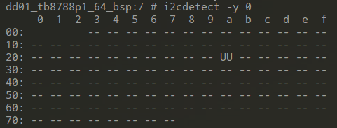

# i2c-tools

#### 介绍
在android 11上编译arm64的i2c-tools工具，基于mt6771平台，i2c-tools-4.2

#### 安装教程

1.  进入Android AOSP根目录，执行 source build/envsetup.sh
2.  执行 lunch full_dd01_tb8788p1_64_bsp-userdebug
3.  将i2c-tools-4.2源码放入 $AOSP/external, 进入$AOSP/external/i2c-tools-4.2, 先添加一个Android.mk文件，内容见源码，然后执行  mm  命令编译即可

wiki链接：https://i2c.wiki.kernel.org/index.php/I2C_Tools

源码下载链接：https://mirrors.edge.kernel.org/pub/software/utils/i2c-tools/

最后编译出的可执行文件在$AOSP/out/target/product/dd01_tb8788p1_64_bsp/system/bin/

#### 使用说明

##### dd01_tb8788p1_64_bsp:/ # i2cdetect -y 0

